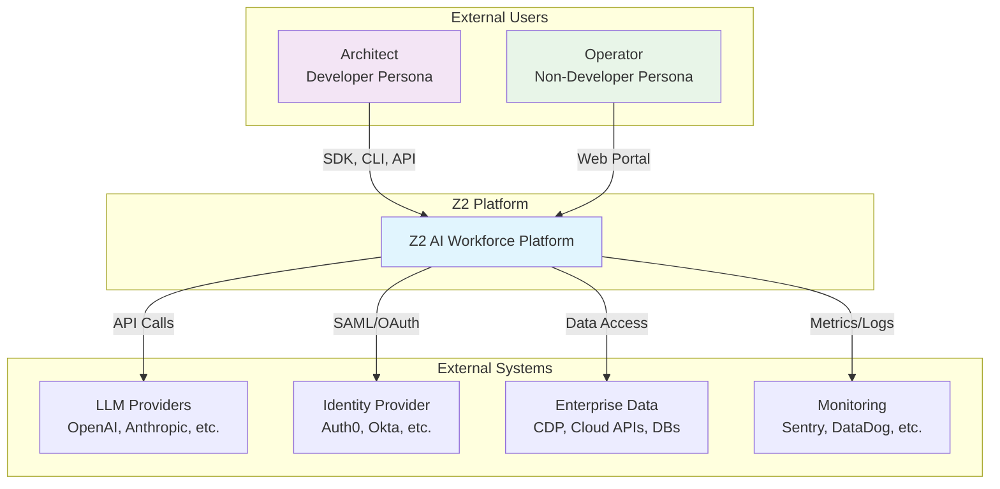
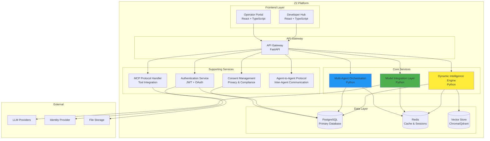
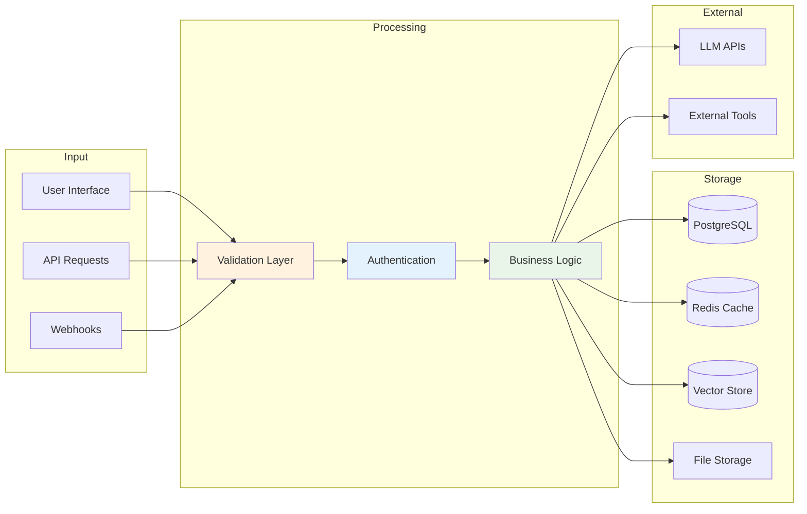
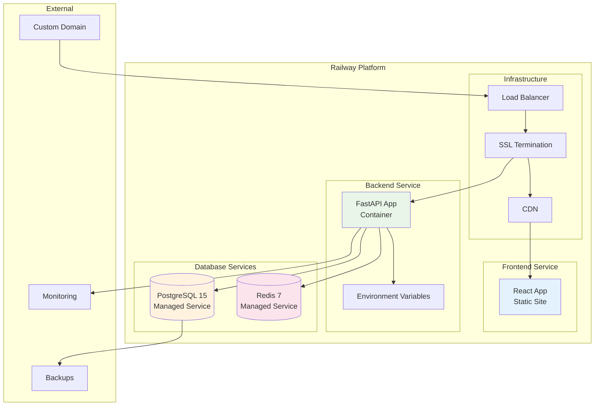

# Z2 AI Workforce Platform - Technical Architecture

## Table of Contents
1. [System Overview](#system-overview)
2. [High-Level Architecture](#high-level-architecture)
3. [Component Architecture](#component-architecture)
4. [Data Architecture](#data-architecture)
5. [Security Architecture](#security-architecture)
6. [Deployment Architecture](#deployment-architecture)
7. [Integration Patterns](#integration-patterns)
8. [API Design](#api-design)
9. [Performance Architecture](#performance-architecture)
10. [Monitoring & Observability](#monitoring--observability)

---

## System Overview

### Vision Statement
Z2 is an enterprise-grade AI workforce platform that enables dynamic multi-agent orchestration through three core frameworks: Dynamic Intelligence Engine (DIE), Model Integration Layer (MIL), and Multi-Agent Orchestration Framework (MAOF).

### Core Principles
- **Dual-Persona Design**: Serves both technical (Architects) and non-technical (Operators) users
- **Model-Agnostic**: Supports multiple LLM providers with dynamic routing
- **Scalable Architecture**: Microservices-based with container orchestration
- **Security-First**: Built-in security, compliance, and audit capabilities
- **Observable**: Comprehensive monitoring, logging, and tracing

### Key Capabilities
- Dynamic prompt generation and context adaptation
- Multi-agent workflow orchestration
- Real-time model routing and cost optimization
- Enterprise security and compliance frameworks
- Comprehensive API ecosystem with SDKs

---

## High-Level Architecture

### C4 Context Diagram



### System Context
- **Architects** interact via SDKs (Python/JS), CLI, REST API, and advanced UI
- **Operators** interact via simplified web portal with guided workflows
- **LLM Providers** supply AI capabilities through standardized APIs
- **Identity Providers** handle authentication and authorization
- **Enterprise Data** sources provide context and business data
- **Monitoring Systems** collect telemetry and observability data

---

## Component Architecture

### C4 Container Diagram



### Core Components

#### 1. Dynamic Intelligence Engine (DIE)
```typescript
interface DIE {
  // Context management
  contextualMemory: ContextualMemory
  promptGenerator: DynamicPromptGenerator
  
  // Core operations
  adaptContextualFlow(context: Context): AdaptedFlow
  generatePrompt(task: Task, context: Context): StructuredPrompt
  optimizeForCost(prompt: Prompt): OptimizedPrompt
  
  // Integration
  compressContext(context: Context): CompressedContext
  summarizeConversation(messages: Message[]): Summary
}
```

**Responsibilities:**
- Dynamic prompt generation with RTF (Role-Task-Format) structure
- Contextual memory management across conversations
- Cost optimization through prompt compression
- Context adaptation based on user behavior

**Implementation Status:** 67% complete
- ✅ ContextualMemory with update methods
- ✅ PromptTemplate with RTF structure  
- ⚠️ Dynamic prompt generation logic (partial)
- ❌ Context compression algorithms
- ❌ Cost optimization features

#### 2. Model Integration Layer (MIL)
```typescript
interface MIL {
  // Provider management
  providers: Map<string, LLMProvider>
  router: ModelRouter
  
  // Core operations
  generateResponse(request: LLMRequest): Promise<LLMResponse>
  routeToOptimalModel(task: Task): ModelSelection
  trackCosts(usage: Usage): CostMetrics
  
  // Provider abstraction
  registerProvider(provider: LLMProvider): void
  healthCheck(): Promise<ProviderHealth[]>
}
```

**Supported Providers:**
- **OpenAI**: GPT-4o series, o-series reasoning models, DALL-E 3, Whisper
- **Anthropic**: Claude 4 series, Claude 3.5/3.7 series with vision
- **Google**: Gemini 2.5/2.0 series, Imagen 4, Veo 3
- **Groq**: Llama 3.1 series, Mixtral, hardware-accelerated inference
- **Perplexity**: Real-time search with citations
- **Specialized**: Qwen (Chinese), Moonshot (web integration)

**Implementation Status:** 40% complete
- ✅ Provider interface and base classes
- ✅ OpenAI provider foundation
- ⚠️ Model routing logic (basic implementation)
- ❌ Multiple provider integrations
- ❌ Cost tracking and optimization
- ❌ Advanced features (streaming, caching)

#### 3. Multi-Agent Orchestration Framework (MAOF)
```typescript
interface MAOF {
  // Agent management
  agentRegistry: AgentRegistry
  workflowEngine: WorkflowEngine
  
  // Orchestration
  createWorkflow(definition: WorkflowDefinition): Workflow
  executeWorkflow(workflow: Workflow): Promise<WorkflowResult>
  manageAgentCommunication(agents: Agent[]): CommunicationChannel
  
  // Advanced features
  implementDebateProtocol(agents: Agent[], topic: string): DebateResult
  handleCollaborativeReasoning(task: ComplexTask): ReasoningResult
}
```

**Agent Types:**
- **Researcher**: Information gathering and analysis
- **Writer**: Content generation and editing  
- **Coder**: Code generation and debugging
- **Analyst**: Data analysis and insights
- **Validator**: Quality assurance and verification
- **Coordinator**: Workflow management and optimization

**Implementation Status:** 43% complete
- ✅ Agent role definitions and enums
- ✅ Workflow structure and status management
- ⚠️ Basic agent instantiation
- ❌ Inter-agent communication protocols  
- ❌ Workflow execution engine
- ❌ Collaborative reasoning mechanisms

---

## Data Architecture

### Database Schema

#### Core Tables
```sql
-- Users and Authentication
CREATE TABLE users (
    id UUID PRIMARY KEY DEFAULT gen_random_uuid(),
    email VARCHAR(255) UNIQUE NOT NULL,
    name VARCHAR(255) NOT NULL,
    role VARCHAR(50) NOT NULL, -- 'architect' | 'operator' | 'admin'
    password_hash VARCHAR(255) NOT NULL,
    is_active BOOLEAN DEFAULT true,
    created_at TIMESTAMP DEFAULT NOW(),
    updated_at TIMESTAMP DEFAULT NOW()
);

-- Agent Definitions
CREATE TABLE agents (
    id UUID PRIMARY KEY DEFAULT gen_random_uuid(),
    name VARCHAR(255) NOT NULL,
    description TEXT,
    type VARCHAR(50) NOT NULL, -- 'researcher' | 'writer' | 'coder' | etc.
    capabilities TEXT[], -- Array of capability strings
    system_prompt TEXT,
    config JSONB, -- Agent-specific configuration
    model_preferences JSONB, -- Preferred models and settings
    created_by UUID REFERENCES users(id),
    created_at TIMESTAMP DEFAULT NOW(),
    updated_at TIMESTAMP DEFAULT NOW()
);

-- Workflow Definitions
CREATE TABLE workflows (
    id UUID PRIMARY KEY DEFAULT gen_random_uuid(),
    name VARCHAR(255) NOT NULL,
    description TEXT,
    definition JSONB NOT NULL, -- Workflow graph definition
    status VARCHAR(50) DEFAULT 'draft', -- 'draft' | 'active' | 'archived'
    created_by UUID REFERENCES users(id),
    created_at TIMESTAMP DEFAULT NOW(),
    updated_at TIMESTAMP DEFAULT NOW()
);

-- Workflow Executions
CREATE TABLE workflow_executions (
    id UUID PRIMARY KEY DEFAULT gen_random_uuid(),
    workflow_id UUID REFERENCES workflows(id),
    status VARCHAR(50) NOT NULL, -- 'pending' | 'running' | 'completed' | 'failed'
    input_data JSONB,
    output_data JSONB,
    execution_trace JSONB, -- Detailed execution log
    started_at TIMESTAMP DEFAULT NOW(),
    completed_at TIMESTAMP,
    created_by UUID REFERENCES users(id)
);

-- Agent Instances (runtime agents)
CREATE TABLE agent_instances (
    id UUID PRIMARY KEY DEFAULT gen_random_uuid(),
    agent_id UUID REFERENCES agents(id),
    execution_id UUID REFERENCES workflow_executions(id),
    status VARCHAR(50) NOT NULL, -- 'created' | 'running' | 'completed' | 'error'
    context JSONB, -- Current agent context
    memory JSONB, -- Agent memory state
    created_at TIMESTAMP DEFAULT NOW(),
    updated_at TIMESTAMP DEFAULT NOW()
);

-- LLM Usage Tracking
CREATE TABLE llm_usage (
    id UUID PRIMARY KEY DEFAULT gen_random_uuid(),
    execution_id UUID REFERENCES workflow_executions(id),
    agent_instance_id UUID REFERENCES agent_instances(id),
    provider VARCHAR(50) NOT NULL,
    model VARCHAR(100) NOT NULL,
    input_tokens INTEGER NOT NULL,
    output_tokens INTEGER NOT NULL,
    cost_usd DECIMAL(10,6),
    latency_ms INTEGER,
    created_at TIMESTAMP DEFAULT NOW()
);
```

#### Consent and Compliance Tables
```sql
-- Consent Management
CREATE TABLE consent_requests (
    id UUID PRIMARY KEY DEFAULT gen_random_uuid(),
    user_id UUID REFERENCES users(id),
    request_type VARCHAR(100) NOT NULL,
    description TEXT NOT NULL,
    data_categories TEXT[] NOT NULL,
    purpose TEXT NOT NULL,
    retention_period VARCHAR(50),
    status VARCHAR(50) DEFAULT 'pending',
    expires_at TIMESTAMP,
    created_at TIMESTAMP DEFAULT NOW()
);

-- Audit Logs
CREATE TABLE audit_logs (
    id UUID PRIMARY KEY DEFAULT gen_random_uuid(),
    user_id UUID REFERENCES users(id),
    action VARCHAR(100) NOT NULL,
    resource_type VARCHAR(50) NOT NULL,
    resource_id UUID,
    details JSONB,
    ip_address INET,
    user_agent TEXT,
    created_at TIMESTAMP DEFAULT NOW()
);
```

### Data Flow Architecture



---

## Security Architecture

### Authentication & Authorization

#### JWT-Based Authentication
```typescript
interface AuthToken {
  access_token: string   // Short-lived (30 min)
  refresh_token: string  // Long-lived (7 days)
  token_type: "Bearer"
  expires_in: number
  scope: string[]
}

interface TokenPayload {
  sub: string           // User ID
  email: string
  role: string         // 'architect' | 'operator' | 'admin'
  permissions: string[]
  iat: number
  exp: number
}
```

#### Role-Based Access Control (RBAC)
```typescript
enum Permission {
  // Agent permissions
  AGENT_CREATE = "agent:create",
  AGENT_READ = "agent:read", 
  AGENT_UPDATE = "agent:update",
  AGENT_DELETE = "agent:delete",
  
  // Workflow permissions
  WORKFLOW_CREATE = "workflow:create",
  WORKFLOW_EXECUTE = "workflow:execute",
  WORKFLOW_MONITOR = "workflow:monitor",
  
  // Admin permissions
  USER_MANAGE = "user:manage",
  SYSTEM_CONFIG = "system:config",
  AUDIT_VIEW = "audit:view"
}

const RolePermissions = {
  operator: [
    Permission.AGENT_READ,
    Permission.WORKFLOW_EXECUTE
  ],
  architect: [
    Permission.AGENT_CREATE,
    Permission.AGENT_READ,
    Permission.AGENT_UPDATE,
    Permission.WORKFLOW_CREATE,
    Permission.WORKFLOW_EXECUTE,
    Permission.WORKFLOW_MONITOR
  ],
  admin: Object.values(Permission)
}
```

### Data Security

#### Encryption
- **At Rest**: PostgreSQL transparent data encryption (TDE)
- **In Transit**: TLS 1.3 for all communications
- **API Keys**: Encrypted storage with key rotation
- **PII**: Field-level encryption for sensitive data

#### Privacy Controls
```typescript
interface PrivacySettings {
  dataRetentionDays: number
  allowDataExport: boolean
  allowDataDeletion: boolean
  consentRequired: boolean
  auditLoggingLevel: 'minimal' | 'standard' | 'detailed'
}
```

### Security Monitoring

#### Threat Detection
- Failed authentication attempts
- Unusual API usage patterns
- Privilege escalation attempts
- Data access anomalies
- LLM prompt injection attempts

#### Compliance Framework
- **GDPR**: Data portability, right to deletion, consent management
- **SOC 2 Type II**: Access controls, monitoring, encryption
- **ISO 27001**: Security management system
- **NIST AI RMF**: AI risk management framework

---

## Deployment Architecture

### Railway.app Architecture



### Container Configuration

#### Backend Container (Dockerfile.backend)
```dockerfile
FROM python:3.11-slim as base

# Install system dependencies
RUN apt-get update && apt-get install -y \
    gcc \
    && rm -rf /var/lib/apt/lists/*

# Install Poetry
RUN pip install poetry==1.6.1

# Configure Poetry
ENV POETRY_NO_INTERACTION=1 \
    POETRY_VENV_IN_PROJECT=1 \
    POETRY_CACHE_DIR=/tmp/poetry_cache

WORKDIR /app

# Install Python dependencies
COPY pyproject.toml poetry.lock ./
RUN poetry install --no-dev && rm -rf $POETRY_CACHE_DIR

# Copy application code
COPY . .

# Health check
HEALTHCHECK --interval=30s --timeout=10s --start-period=5s --retries=3 \
    CMD curl -f http://localhost:$PORT/health || exit 1

# Run application
CMD ["poetry", "run", "uvicorn", "app.main:app", "--host", "0.0.0.0", "--port", "$PORT"]
```

#### Frontend Container (Dockerfile.frontend)
```dockerfile
FROM node:18-alpine as builder

WORKDIR /app

# Install dependencies
COPY package*.json ./
RUN npm ci --only=production

# Build application
COPY . .
RUN npm run build

# Production stage
FROM nginx:alpine

# Copy built assets
COPY --from=builder /app/dist /usr/share/nginx/html

# Copy nginx configuration
COPY nginx.conf /etc/nginx/nginx.conf

EXPOSE 80

CMD ["nginx", "-g", "daemon off;"]
```

### Environment Management

#### Development Environment
```bash
# Local development with Docker
docker-compose up -d postgres redis
poetry run uvicorn app.main:app --reload
npm run dev
```

#### Staging Environment
```bash
# Railway staging deployment
railway environment:create staging
railway variables:set --environment staging DEBUG=true
railway deploy --environment staging
```

#### Production Environment
```bash
# Railway production deployment
railway environment:create production
railway variables:set --environment production DEBUG=false
railway deploy --environment production
```

---

## Integration Patterns

### LLM Provider Integration

#### Standardized Provider Interface
```typescript
interface LLMProvider {
  name: string
  capabilities: ModelCapability[]
  
  // Core methods
  generateText(request: TextRequest): Promise<TextResponse>
  generateImage(request: ImageRequest): Promise<ImageResponse>
  generateEmbedding(request: EmbeddingRequest): Promise<EmbeddingResponse>
  
  // Streaming support
  streamText(request: TextRequest): AsyncIterable<TextChunk>
  
  // Provider-specific
  getModels(): Promise<Model[]>
  getUsage(): Promise<UsageMetrics>
  healthCheck(): Promise<HealthStatus>
}
```

#### Provider Implementations
```typescript
class OpenAIProvider implements LLMProvider {
  private client: OpenAI
  
  constructor(apiKey: string) {
    this.client = new OpenAI({ apiKey })
  }
  
  async generateText(request: TextRequest): Promise<TextResponse> {
    const completion = await this.client.chat.completions.create({
      model: request.model,
      messages: request.messages,
      max_tokens: request.maxTokens,
      temperature: request.temperature
    })
    
    return {
      text: completion.choices[0].message.content,
      usage: completion.usage,
      model: completion.model
    }
  }
}
```

### Agent Communication Protocol (A2A)

#### Message Format
```typescript
interface A2AMessage {
  id: string
  type: 'request' | 'response' | 'notification'
  sender: AgentIdentifier
  recipient: AgentIdentifier
  payload: any
  timestamp: string
  signature?: string
}

interface AgentIdentifier {
  agentId: string
  instanceId: string
  workflowId: string
}
```

#### Communication Patterns
```typescript
// Request-Response Pattern
async sendRequest(recipient: AgentIdentifier, request: any): Promise<any> {
  const message: A2AMessage = {
    id: generateId(),
    type: 'request',
    sender: this.identifier,
    recipient,
    payload: request,
    timestamp: new Date().toISOString()
  }
  
  return await this.messageQueue.sendAndWait(message)
}

// Publish-Subscribe Pattern
async publishEvent(event: any): Promise<void> {
  const message: A2AMessage = {
    id: generateId(),
    type: 'notification',
    sender: this.identifier,
    recipient: { agentId: '*', instanceId: '*', workflowId: this.workflowId },
    payload: event,
    timestamp: new Date().toISOString()
  }
  
  await this.eventBus.publish(message)
}
```

### MCP (Model Context Protocol) Integration

#### Tool Integration
```typescript
interface MCPTool {
  name: string
  description: string
  parameters: JSONSchema
  
  execute(params: any): Promise<ToolResult>
}

class FileSystemTool implements MCPTool {
  name = "filesystem"
  description = "Read and write files"
  
  async execute(params: { action: string, path: string, content?: string }) {
    switch (params.action) {
      case 'read':
        return { content: await fs.readFile(params.path, 'utf8') }
      case 'write':
        await fs.writeFile(params.path, params.content)
        return { success: true }
      default:
        throw new Error(`Unknown action: ${params.action}`)
    }
  }
}
```

---

## API Design

### REST API Structure

#### Base URL Pattern
```
Production:  https://api.z2.ai/v1
Staging:     https://api-staging.z2.ai/v1  
Development: http://localhost:8000/api/v1
```

#### Resource Endpoints

**Agents**
```typescript
GET    /agents                 // List agents
POST   /agents                 // Create agent
GET    /agents/{id}            // Get agent details
PUT    /agents/{id}            // Update agent
DELETE /agents/{id}            // Delete agent
POST   /agents/{id}/test       // Test agent
GET    /agents/{id}/metrics    // Agent metrics
```

**Workflows**
```typescript
GET    /workflows              // List workflows
POST   /workflows              // Create workflow
GET    /workflows/{id}         // Get workflow
PUT    /workflows/{id}         // Update workflow
DELETE /workflows/{id}         // Delete workflow
POST   /workflows/{id}/execute // Execute workflow
GET    /workflows/{id}/status  // Execution status
GET    /workflows/{id}/results // Execution results
```

**Models**
```typescript
GET    /models                 // List available models
GET    /models/{id}            // Model details
POST   /models/test           // Test model
GET    /models/usage          // Usage statistics
GET    /models/costs          // Cost analysis
```

#### Response Format
```typescript
interface APIResponse<T> {
  success: boolean
  data?: T
  error?: {
    code: string
    message: string
    details?: any
  }
  meta?: {
    page?: number
    total?: number
    timestamp: string
  }
}
```

### WebSocket API

#### Real-time Updates
```typescript
// Workflow execution updates
interface WorkflowUpdate {
  type: 'workflow.status' | 'workflow.progress' | 'workflow.complete'
  workflowId: string
  status: string
  progress?: number
  data?: any
}

// Agent activity updates  
interface AgentUpdate {
  type: 'agent.started' | 'agent.thinking' | 'agent.complete'
  agentId: string
  instanceId: string
  message?: string
  data?: any
}
```

#### Connection Management
```typescript
class WebSocketManager {
  private connections = new Map<string, WebSocket>()
  
  subscribe(userId: string, topics: string[]) {
    // Subscribe user to specific update topics
  }
  
  broadcast(topic: string, data: any) {
    // Broadcast update to all subscribers of topic
  }
  
  sendToUser(userId: string, data: any) {
    // Send data to specific user
  }
}
```

---

## Performance Architecture

### Caching Strategy

#### Multi-Level Caching
```typescript
interface CacheStrategy {
  // L1: In-memory cache (Redis)
  memory: {
    ttl: number
    maxSize: string
    evictionPolicy: 'LRU' | 'LFU'
  }
  
  // L2: Database query cache
  database: {
    enabled: boolean
    ttl: number
  }
  
  // L3: CDN cache (static assets)
  cdn: {
    ttl: number
    regions: string[]
  }
}
```

#### Cache Implementation
```python
class CacheManager:
    def __init__(self, redis_client: Redis):
        self.redis = redis_client
        
    async def get_or_set(
        self, 
        key: str, 
        factory: Callable,
        ttl: int = 300
    ) -> Any:
        # Try cache first
        cached = await self.redis.get(key)
        if cached:
            return json.loads(cached)
            
        # Generate and cache
        value = await factory()
        await self.redis.setex(
            key, 
            ttl, 
            json.dumps(value, default=str)
        )
        return value
```

### Database Optimization

#### Connection Pooling
```python
# SQLAlchemy async engine configuration
engine = create_async_engine(
    DATABASE_URL,
    pool_size=20,          # Base connections
    max_overflow=30,       # Additional connections
    pool_timeout=30,       # Wait time for connection
    pool_recycle=3600,     # Recycle connections hourly
    pool_pre_ping=True,    # Validate connections
)
```

#### Query Optimization
```sql
-- Indexes for common query patterns
CREATE INDEX CONCURRENTLY idx_agents_type_status 
ON agents(type, status) WHERE status = 'active';

CREATE INDEX CONCURRENTLY idx_workflows_user_created 
ON workflows(created_by, created_at DESC);

CREATE INDEX CONCURRENTLY idx_executions_status_started 
ON workflow_executions(status, started_at DESC);

-- Partial indexes for better performance
CREATE INDEX CONCURRENTLY idx_active_agents 
ON agents(id) WHERE status = 'active';
```

### Load Balancing

#### Application Load Balancing
```yaml
# Railway load balancer configuration
load_balancer:
  algorithm: "round_robin"
  health_check:
    path: "/health"
    interval: 30
    timeout: 10
    healthy_threshold: 2
    unhealthy_threshold: 3
  
  sticky_sessions: false
  timeout: 30
```

#### Database Load Balancing
```python
# Read replica routing
class DatabaseRouter:
    def __init__(self):
        self.write_engine = create_engine(PRIMARY_DB_URL)
        self.read_engines = [
            create_engine(url) for url in READ_REPLICA_URLS
        ]
    
    def get_engine(self, operation: str):
        if operation in ['SELECT']:
            return random.choice(self.read_engines)
        return self.write_engine
```

---

## Monitoring & Observability

### Metrics Collection

#### Application Metrics
```python
from prometheus_client import Counter, Histogram, Gauge

# Request metrics
request_count = Counter(
    'http_requests_total',
    'Total HTTP requests',
    ['method', 'endpoint', 'status']
)

request_duration = Histogram(
    'http_request_duration_seconds',
    'HTTP request latency'
)

# Agent metrics
agent_executions = Counter(
    'agent_executions_total',
    'Total agent executions',
    ['agent_type', 'status']
)

active_workflows = Gauge(
    'workflows_active',
    'Currently active workflows'
)

# LLM metrics
llm_requests = Counter(
    'llm_requests_total',
    'Total LLM requests',
    ['provider', 'model']
)

llm_cost = Counter(
    'llm_cost_usd_total',
    'Total LLM costs in USD',
    ['provider', 'model']
)
```

#### Infrastructure Metrics
- CPU utilization
- Memory usage
- Disk I/O
- Network I/O
- Database connections
- Cache hit rates

### Logging Architecture

#### Structured Logging
```python
import structlog

logger = structlog.get_logger()

# Example usage
await logger.info(
    "Workflow execution started",
    workflow_id=workflow.id,
    user_id=user.id,
    agent_count=len(workflow.agents),
    estimated_duration=workflow.estimated_duration
)
```

#### Log Aggregation
```yaml
# Railway log configuration
logging:
  level: INFO
  format: json
  outputs:
    - console
    - file: /app/logs/app.log
    - syslog: railway-logs
```

### Alerting

#### Alert Rules
```yaml
alerts:
  - name: HighErrorRate
    condition: error_rate > 5%
    duration: 5m
    severity: warning
    
  - name: WorkflowExecutionFailure
    condition: workflow_failure_rate > 10%
    duration: 2m
    severity: critical
    
  - name: DatabaseConnectionIssue
    condition: db_connection_errors > 0
    duration: 1m
    severity: critical
    
  - name: LLMAPIFailure
    condition: llm_api_errors > 5
    duration: 5m
    severity: warning
```

### Distributed Tracing

#### OpenTelemetry Integration
```python
from opentelemetry import trace
from opentelemetry.exporter.jaeger.thrift import JaegerExporter
from opentelemetry.sdk.trace import TracerProvider
from opentelemetry.sdk.trace.export import BatchSpanProcessor

# Configure tracing
trace.set_tracer_provider(TracerProvider())
tracer = trace.get_tracer(__name__)

jaeger_exporter = JaegerExporter(
    agent_host_name="localhost",
    agent_port=6831,
)

span_processor = BatchSpanProcessor(jaeger_exporter)
trace.get_tracer_provider().add_span_processor(span_processor)

# Usage in application
@tracer.start_as_current_span("workflow_execution")
async def execute_workflow(workflow_id: str):
    with tracer.start_as_current_span("load_workflow"):
        workflow = await load_workflow(workflow_id)
        
    with tracer.start_as_current_span("execute_agents"):
        results = await execute_agents(workflow.agents)
        
    return results
```

---

*This technical architecture document serves as the definitive reference for Z2 platform implementation. It will be updated as the system evolves. Last updated: 2024-12-19*